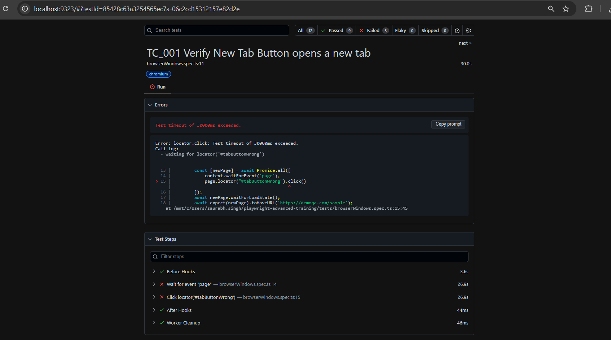
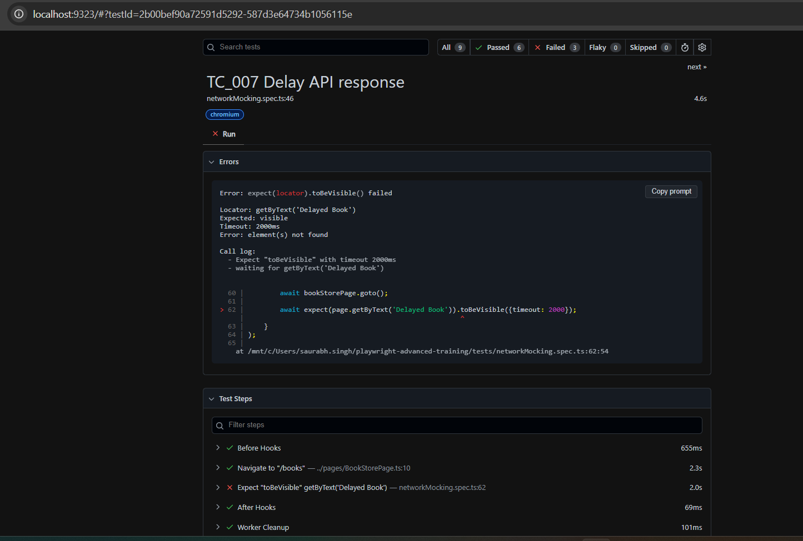
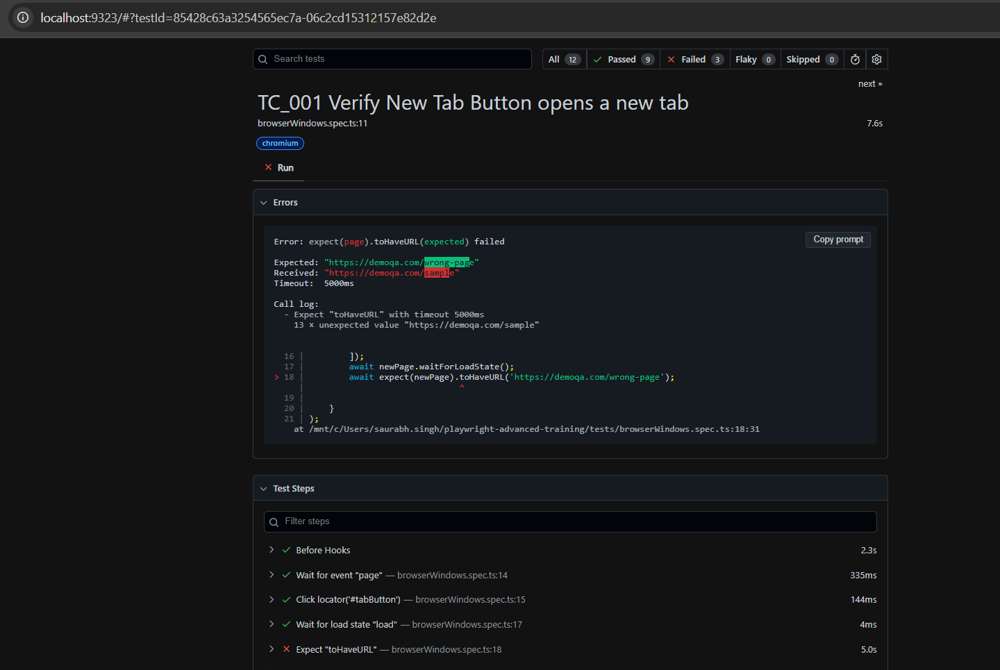
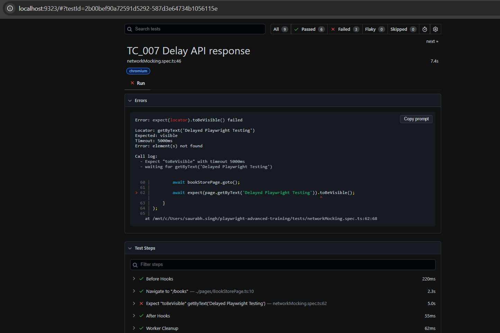
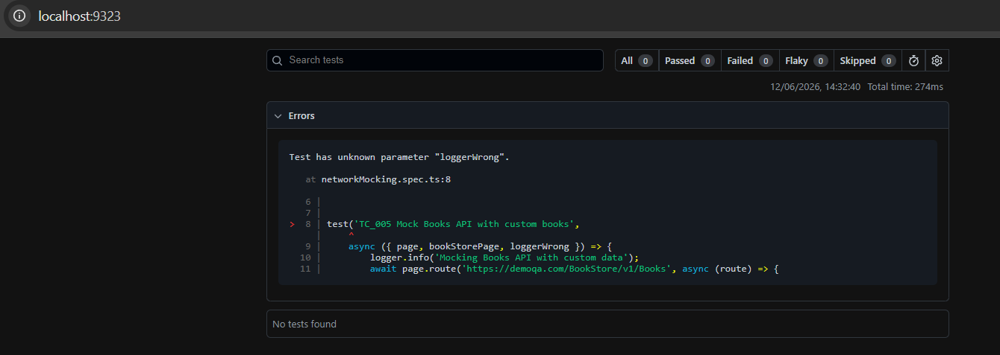
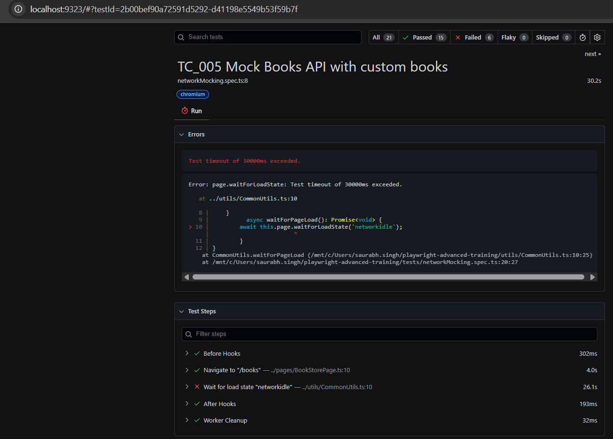
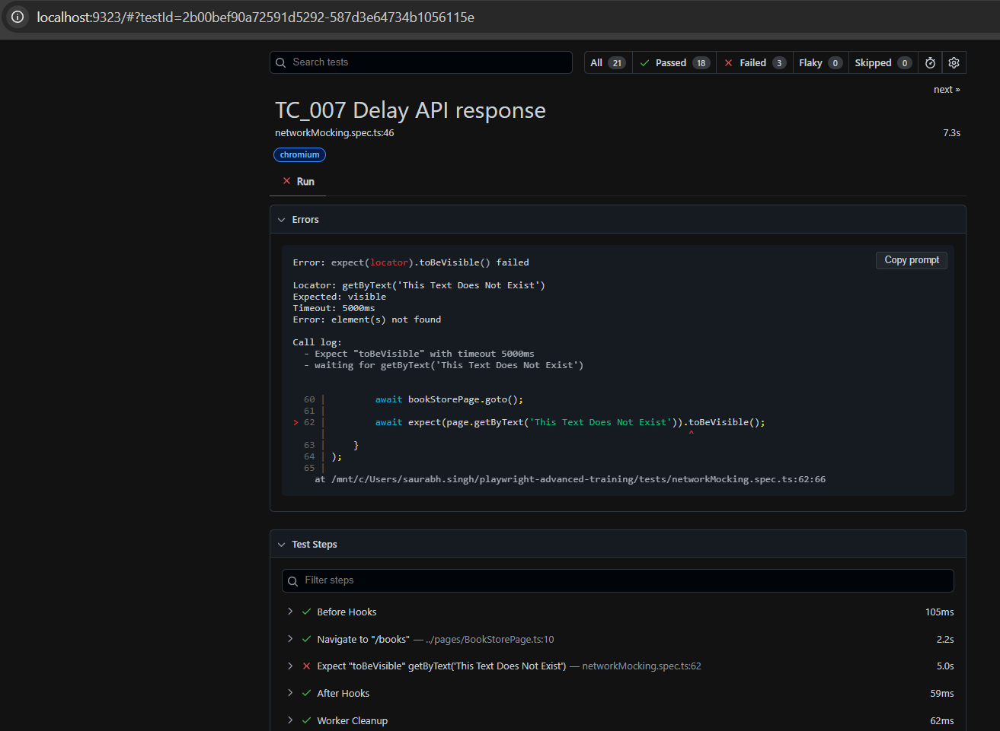
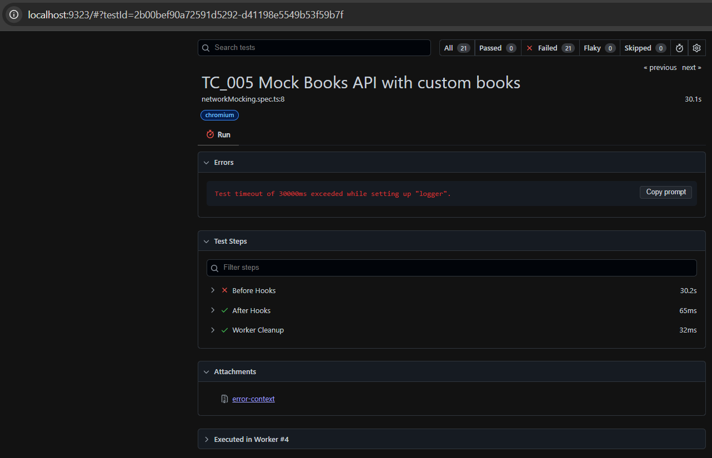
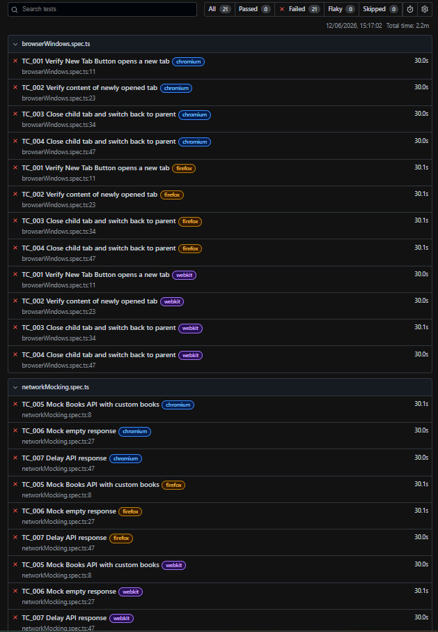

##### FAILURE CATEGORIES

# Failure Category 1 - Incorrect Locator

## Steps USed to Simulate
 Changed locator from:
   #tabButton
 to:
   #tabButtonWrong  

## Root Cause
The locator did not match any element present on the page

## Failure Log
Error: locator.click: Test timeout of 30000ms exceeded.
Call log:
  - waiting for locator('#tabButtonWrong')

# Failure Category 2 - Synchronization/ Timing Failure

## Steps USed to Simulate
1. Increased mocked API response delay to 10 seconds.
2. Reduced assertion timeout to 2 seconds.
3. Executed TC_007.
4. Observed synchronization failure

## Root Cause
Application response was delayed, but assertion timeout was shorter than the response time.

## Failure Log
Error: expect(locator).toBeVisible() failed

Locator: getByText('Delayed Book')
Expected: visible
Timeout: 2000ms
Error: element(s) not found

Call log:
  - Expect "toBeVisible" with timeout 2000ms
  - waiting for getByText('Delayed Book')

# Failure Category 3 - URL Assertion

## Steps Used to Simulate
1. Modified URL assertion from /sample/ to /wrong-page/.
2. Executed the Browser Windows tests.
3. Observed assertion failure

## Root Cause
Expected URL pattern did not match the actual page URl

## Failure Log
Error: expect(page).toHaveURL(expected) failed

Expected: "https://demoqa.com/wrong-page"
Received: "https://demoqa.com/sample"
Timeout:  5000ms

Call log:
  - Expect "toHaveURL" with timeout 5000ms
    13 × unexpected value "https://demoqa.com/sample"

    

# Failure Category 4 - Mock Data Validation Failure

## Steps Used to Simulate
1. Kept mocked API response title as 'Delayed Book'.
2. Modified assertion to validate 'Delayed Playwright Testing'.
3. Executed TC_007.
4. Observed assertion failure.

## Root Cause
Assertion expected a different value than the value returned by the mocked API response.

## Failure Log
Error: expect(locator).toBeVisible() failed

Locator: getByText('Delayed Playwright Testing')
Expected: visible
Timeout: 5000ms
Error: element(s) not found

Call log:
  - Expect "toBeVisible" with timeout 5000ms
  - waiting for getByText('Delayed Playwright Testing')

# Failure Category 5 - Fixture Misconfiguration Failure

## Steps Used to Simulate
1. Renamed fixture parameter from logger to loggerWrong.
2. Executed the test suite.
3. Observed fixture resolution failure.

## Root Cause
Test attempted to use a fixture that was not defined in customFixtures.ts

## Failure Log
Test has unknown parameter "loggerWrong".

   at networkMocking.spec.ts:8

##### TIMEOUT CATEGORIES

# Timeout Category 1 - Test Timeout

## Steps Used to Simulate
1. Used waitForLoadState('networkidle') inside CommonUtils.
2. Executed the network mocking tests.
3. Observed test timeout during execution

## Root Cause
The page continued making background network requests, preventing the browser from reaching the 'networkidle' state.
As a result, the test exceeded the configured test timeout limit.

## Failure Log
Test timeout of 30000ms exceeded.
Error: page.waitForLoadState: Test timeout of 30000ms exceeded.

   at ../utils/CommonUtils.ts:10

# Timeout Category 2 - Expect Timeout

## Steps Used to Simulate
1. Modified the expected text to a value not present on the page.
2. Executed the test
3. Observed Expect Timeout

## Root Cause
The expected element was not found within the configured expectations timeout period.

## Failure Log
Error: expect(locator).toBeVisible() failed

Locator: getByText('This Text Does Not Exist')
Expected: visible
Timeout: 5000ms
Error: element(s) not found

Call log:
  - Expect "toBeVisible" with timeout 5000ms
  - waiting for getByText('This Text Does Not Exist')

  

# Timeout Category 3 - Fixture Initialization Timeout

## Steps Used to Simulate
1. Added a 35-second delay during logger fixture initialization.
2. Executed the test suite.
3. Observed that all tests failed before execution started.

## Root Cause
The shared logger fixture exceeded the test timeout during setup. Since all tests depended on this fixture, the entire suite failed.

## Failure Log
Test timeout of 30000ms exceeded while setting up "logger".

